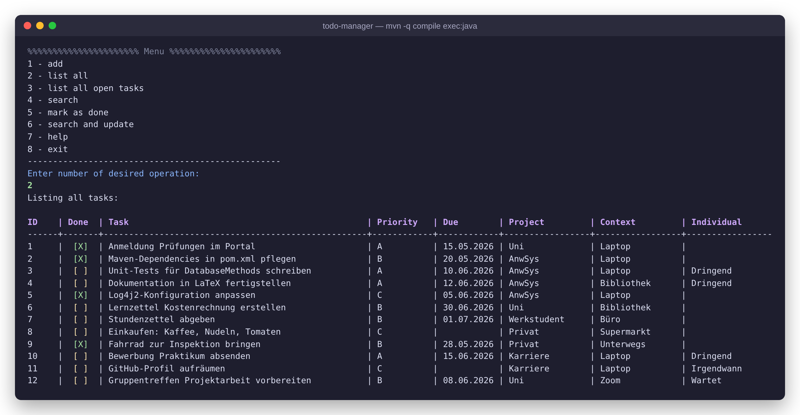
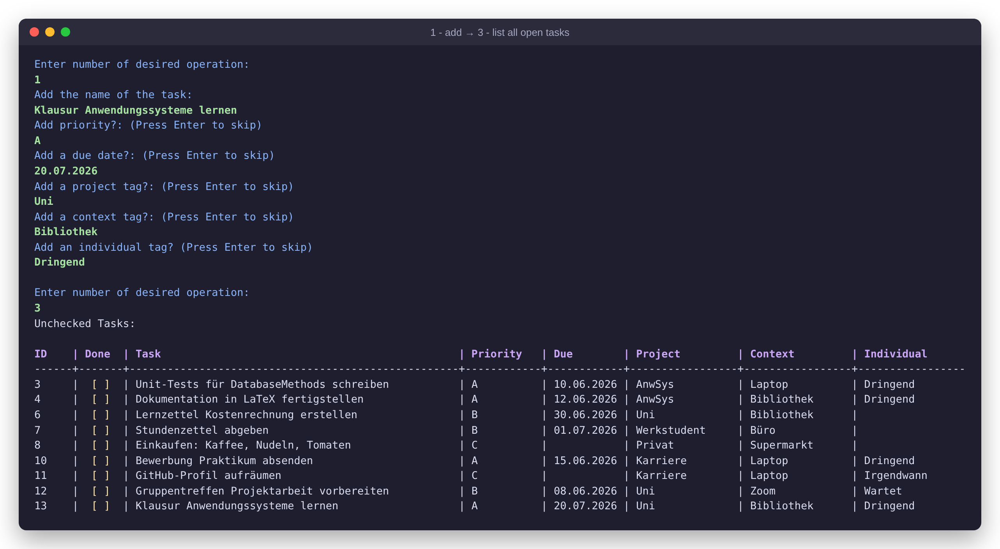
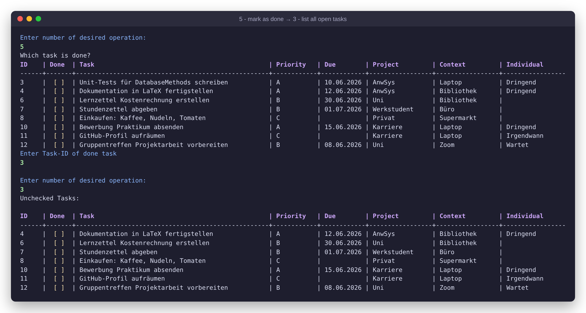
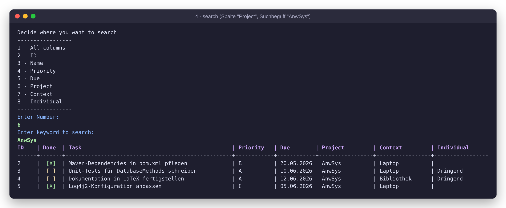
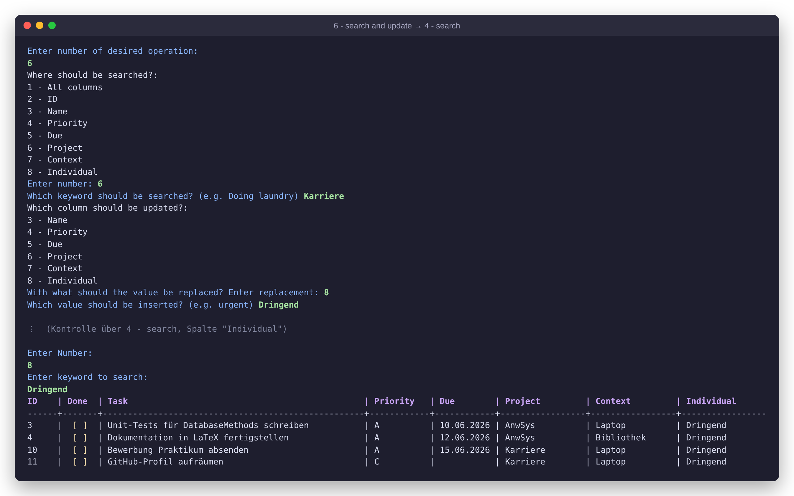
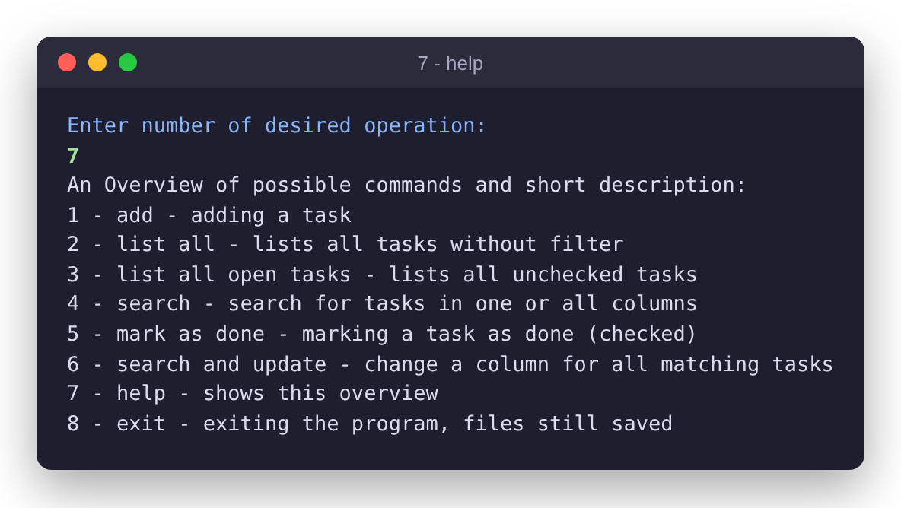
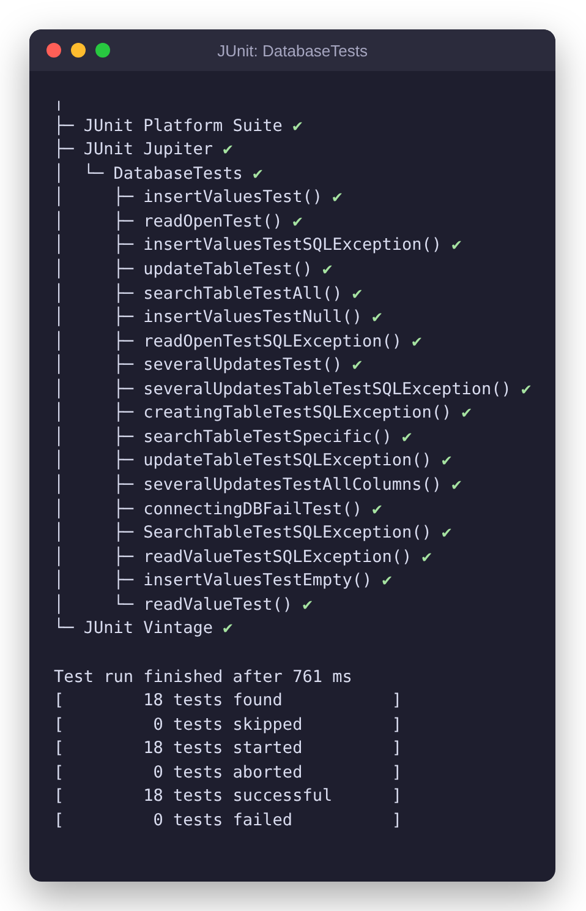

# To-Do-Manager (Java · Maven · SQLite)


Ein interaktiver To-do-Manager für das Terminal, geschrieben in Java. Die Aufgaben werden dauerhaft in einer
SQLite-Datenbank gespeichert. Man kann sie anlegen, filtern, durchsuchen, abhaken und mehrere Einträge auf einmal ändern.

Das Projekt ist im Modul **Anwendungssysteme** (Enterprise Programming) meines Studiums im Wirtschaftsingenieurwesen
an der **TU Berlin** entstanden. Es war mein erstes Java-Projekt mit professionellem Werkzeug: Build- und
Abhängigkeitsverwaltung mit **Maven** (`pom.xml`), Unit-Tests mit **JUnit**, Logging mit **Log4j2** und weniger
Boilerplate-Code dank **Lombok**.



---

## Funktionen

| # | Menüpunkt | Beschreibung |
|---|-----------|--------------|
| 1 | **add** | Neue Aufgabe anlegen. Der Name ist Pflicht; Priorität, Fälligkeitsdatum, Projekt-, Kontext- und ein freier Tag sind optional (mit Enter überspringen). |
| 2 | **list all** | Alle Aufgaben als formatierte Tabelle mit Status `[X]` / `[ ]` anzeigen. |
| 3 | **list all open tasks** | Nur offene Aufgaben anzeigen. |
| 4 | **search** | In allen Spalten oder gezielt in einer Spalte (ID, Name, Priorität, Datum, Projekt, Kontext, Tag) suchen. Teilbegriffe genügen (`Ler` findet `Lernen`). |
| 5 | **mark as done** | Eine Aufgabe über ihre ID als erledigt markieren. |
| 6 | **search and update** | Massenänderung: Alle Treffer einer Suche erhalten in einer gewählten Spalte einen neuen Wert (z. B. alle Aufgaben mit Projekt `Karriere` den Tag `Dringend`). |
| 7 | **help** | Übersicht aller Befehle. |
| 8 | **exit** | Programm beenden. Die Daten bleiben in `ToDo.db` erhalten. |

Außerdem:

- **Persistenz:** Die Datenbank `ToDo.db` wird beim ersten Start automatisch angelegt.
- **Robuste Eingabe:** Ungültige Eingaben im Hauptmenü werden abgefangen und die Anwendung läuft weiter.
- **Sichere SQL-Abfragen:** Benutzereingaben werden ausschließlich über `PreparedStatement`-Platzhalter übergeben (Schutz vor SQL-Injection).
- **Trennung von Ausgabe und Logging:** Meldungen für Nutzer:innen laufen über `System.out`, Entwickler-Logs über Log4j2 (Level in `log4j2.xml` konfigurierbar).

## Tech-Stack

| Bereich | Technologie |
|---------|-------------|
| Sprache | Java 21 |
| Build & Dependencies | Maven (`pom.xml`) |
| Datenbank | SQLite über `org.xerial:sqlite-jdbc` (JDBC) |
| Boilerplate-Reduktion | Lombok (`@Data`, `@NonNull`, `@UtilityClass`, `@Log4j2`) |
| Logging | Log4j2 (API + Core) |
| Tests | JUnit 5 mit In-Memory-SQLite-Datenbank |

## Architektur

```
src/
├── main/java/anwsys/a1/
│   ├── Main.java             Einstiegspunkt: Hauptschleife, Menü, switch-case-Steuerung
│   ├── Methods.java          Nutzerdialog: fragt Eingaben ab und delegiert an die DB-Schicht
│   ├── DatabaseMethods.java  Datenzugriff: alle SQL-Operationen (CREATE, INSERT, SELECT, UPDATE)
│   └── Task.java             Datenmodell einer Aufgabe (Lombok @Data)
├── main/resources/log4j2.xml Logging-Konfiguration
└── test/java/DatabaseTests.java  18 Unit-Tests (Standard-, Grenz- und Fehlerfälle)
```

Tabelle `ToDo`:

| Spalte | Typ | Bedeutung |
|--------|-----|-----------|
| `id` | INTEGER, PK, AUTOINCREMENT | eindeutige ID |
| `checked` | INTEGER NOT NULL | 0 = offen, 1 = erledigt |
| `taskName` | TEXT NOT NULL | Name der Aufgabe |
| `taskPriority` | TEXT | Priorität, z. B. A/B/C |
| `DueDate` | TEXT | Fälligkeitsdatum |
| `ProjectTag` | TEXT | Projekt |
| `ContextTag` | TEXT | Kontext (Ort/Werkzeug) |
| `SpecialTag` | TEXT | freier Tag („Individual“) |

## Installation und Start

**Voraussetzungen:** JDK 21 und Maven 3.9+ (alternativ IntelliJ IDEA, das Maven mitbringt).

```bash
git clone https://github.com/Gregor5499/todo-manager-java.git
cd todo-manager-java

# Kompilieren und starten
mvn -q compile exec:java

# Unit-Tests ausführen
mvn test
```

**In IntelliJ IDEA:** Den Ordner öffnen (die `pom.xml` wird automatisch erkannt) und `anwsys.a1.Main` starten.
Für Lombok muss unter *Settings → Build → Compiler → Annotation Processors* die Annotation-Verarbeitung aktiviert sein.

## Bedienung

Nach dem Start erscheint das Hauptmenü. Man wählt eine Operation, indem man ihre Nummer eingibt und mit Enter bestätigt.
Nach jeder Operation kehrt das Programm ins Menü zurück.

### Aufgabe anlegen (1) und offene Aufgaben anzeigen (3)

Alle Felder außer dem Namen lassen sich mit Enter überspringen.



### Aufgabe erledigen (5)

Das Programm zeigt die offenen Aufgaben. Nach Eingabe der ID wird die Aufgabe abgehakt und verschwindet aus der offenen Liste.



### Suchen (4)

Zuerst wählt man die Spalte (oder `1` für alle Spalten), dann den Suchbegriff:



### Suchen und ändern (6)

Alle Aufgaben, die zum Suchbegriff passen, bekommen in der gewählten Spalte denselben neuen Wert:



<details>
<summary>Hilfe-Übersicht (7)</summary>


</details>

## Tests

Die Klasse `DatabaseTests` prüft alle Methoden von `DatabaseMethods` gegen eine **In-Memory-SQLite-Datenbank**
(`jdbc:sqlite::memory:`), die vor jedem Test neu erzeugt wird (`@BeforeEach`/`@AfterEach`). So sind die Tests
reproduzierbar und berühren die echte Datenbank nicht. Abgedeckt sind:

- **Standardfälle:** Einfügen, Lesen, Suchen (gezielt und in allen Spalten), Updates und Massen-Updates
- **Grenzfälle:** fehlender oder leerer Aufgabenname führt zu `IllegalArgumentException`
- **Fehlerfälle:** Methoden auf geschlossener Verbindung zeigen, dass jede `SQLException` intern abgefangen wird

Ergebnis: **18/18 Tests grün, 97 % Line Coverage** auf `DatabaseMethods`.

<details>
<summary>Testlauf</summary>


</details>

## Dokumentation

Die ausführliche Projektdokumentation (in LaTeX geschrieben) erklärt Programmfluss, Maven-Konfiguration,
Teststrategie, Lombok und das Logging-Konzept mit Code-Auszügen:

📄 **[Dokumentation als PDF](docs/Dokumentation_ToDo-Manager.pdf)**

## Grenzen und mögliche Erweiterungen

Das Projekt war eine Lernaufgabe mit Fokus auf Maven und Tooling. Diese Punkte würde ich heute anders lösen:

- Aufgaben löschen und einzelne Aufgaben bearbeiten (bisher nur über die Massenänderung möglich)
- Datum als echter Datumstyp statt Text, damit man nach Fälligkeit sortieren und filtern kann
- Objektorientierteres Design (Repository-Klasse statt statischer Utility-Methoden) und nur ein gemeinsamer `Scanner`
- Eingabevalidierung auch in den Untermenüs
- Ausführbares Fat-JAR über das `maven-shade-plugin`

## Änderungen nach der Abgabe

Für die Veröffentlichung habe ich einige kleine Korrekturen vorgenommen: Die Suche in der Spalte „Individual“
schlug wegen eines Tippfehlers im Spaltennamen fehl, der Hilfetext war unvollständig und die Tabelle der
Suchergebnisse war schmaler als die übrigen Tabellen. In der `pom.xml` sind Surefire- und Exec-Plugin
dazugekommen, damit `mvn test` und `mvn exec:java` auch ohne IDE funktionieren. Das Log-Level steht jetzt
standardmäßig auf `warn`, damit die Terminal-Ausgabe übersichtlich bleibt.
